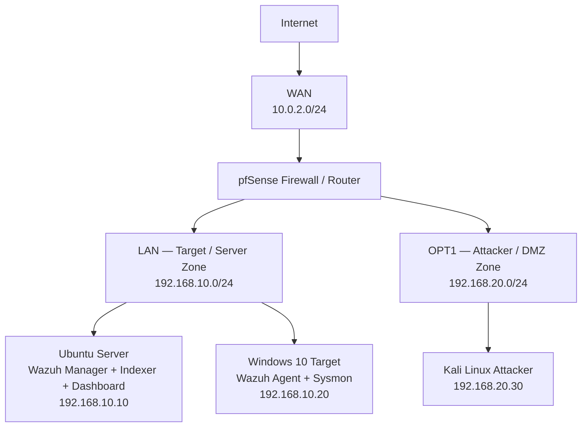
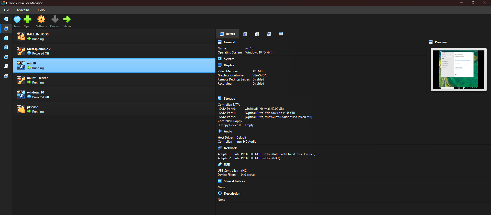
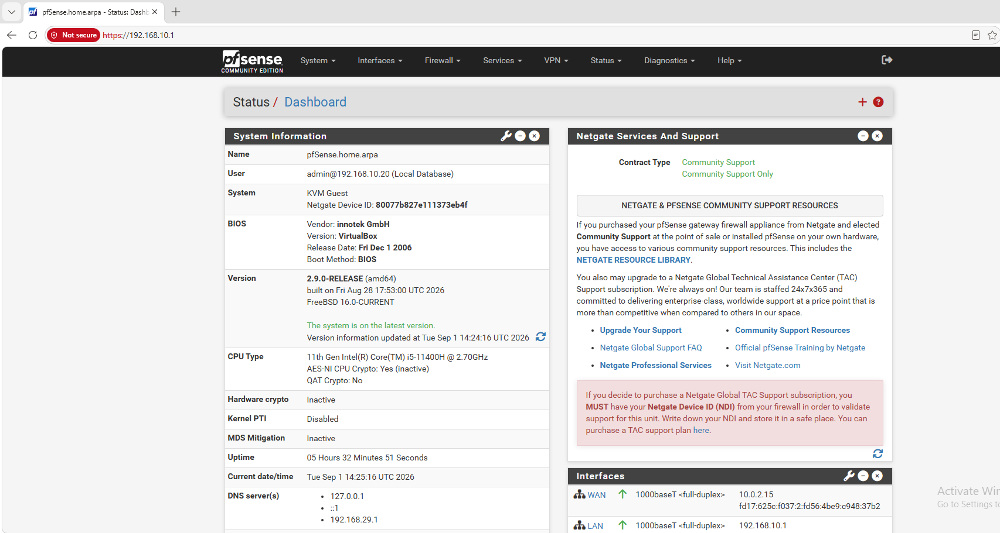
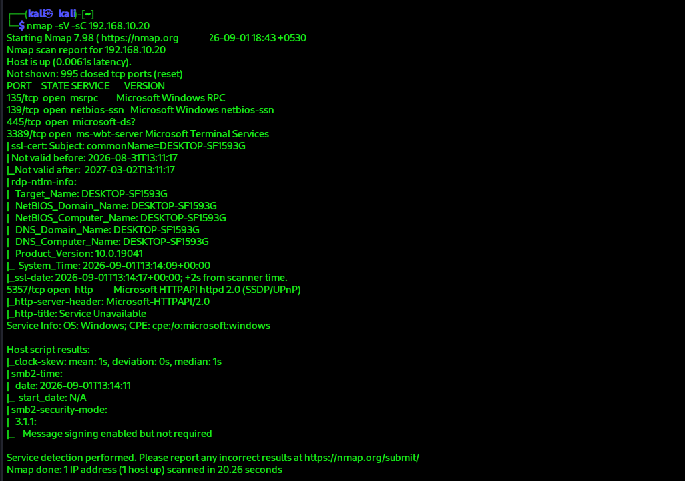
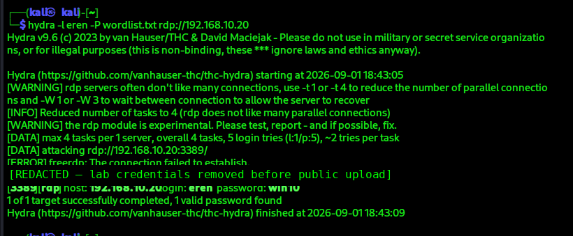
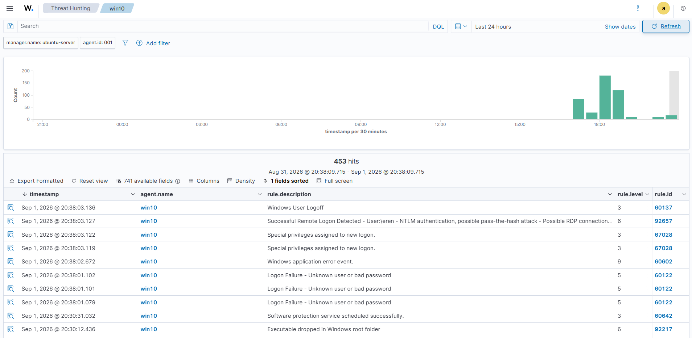
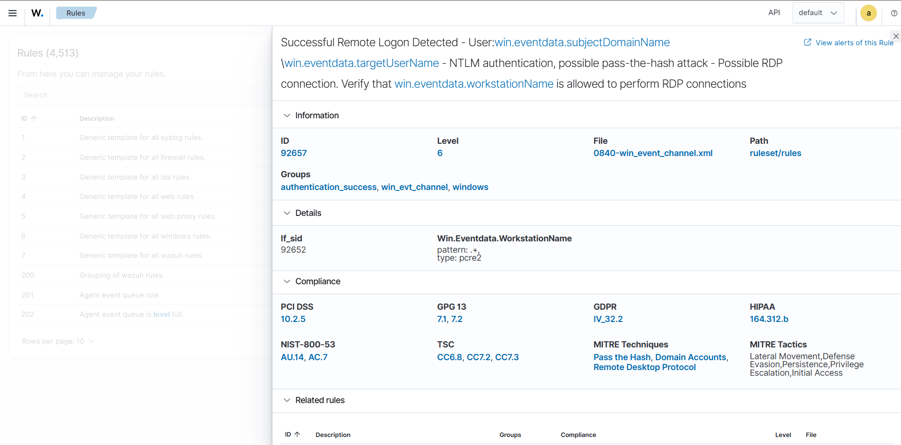

# 🛡️ Home SOC Lab — Attack Detection & Monitoring

A self-built Security Operations Center (SOC) lab running on VirtualBox to practice network segmentation, SIEM monitoring, endpoint telemetry, attack simulation, and alert investigation.

The environment simulates a small company network with a firewall, a protected target zone, and a separated attacker zone. Kali Linux is used to generate controlled attacks against a Windows 10 target, while Wazuh collects and analyzes security telemetry.

## 🎯 Project Objectives

- Build a segmented home SOC environment.
- Use **pfSense** as the firewall/router between security zones.
- Centralize endpoint security telemetry with **Wazuh**.
- Improve Windows visibility using **Sysmon**.
- Simulate reconnaissance and authentication attacks from Kali Linux.
- Observe and investigate the resulting alerts in the Wazuh dashboard.
- Practice SOC Analyst (Tier 1) skills: monitoring, detection, and investigation.

## 🏗️ Lab Architecture



## 🖥️ Components

| Component | Role | Address / Zone |
|---|---|---|
| pfSense | Firewall / Router | LAN `192.168.10.1` / OPT1 `192.168.20.1` |
| Ubuntu Server | Wazuh Manager, Indexer, Dashboard | LAN `192.168.10.10` |
| Windows 10 | Monitored target | LAN `192.168.10.20` |
| Kali Linux | Attacker / testing machine | OPT1 `192.168.20.30` |

## 🔐 Network Segmentation

The lab is split into three zones:

- **WAN** — internet access for updates and downloads.
- **LAN** — protected zone containing the Wazuh server and Windows target.
- **OPT1 / DMZ** — isolated attacker zone containing Kali Linux.

A pfSense firewall rule was added on OPT1 so the Kali system can reach the required destination network for attack simulations. Firewall logging is enabled.

## 📡 Security Data Flow

```text
Windows 10
   │
   ├── Windows Event Logs
   └── Sysmon telemetry
          │
          ▼
     Wazuh Agent
          │
          ▼
    Wazuh Manager
          │
          ▼
    Wazuh Indexer
          │
          ▼
    Wazuh Dashboard
          │
          ▼
   Detection / Investigation
```

The lab documentation describes the Wazuh data path as Agent → Manager → Indexer → Dashboard, with Sysmon events collected from the Windows Event Channel `Microsoft-Windows-Sysmon/Operational`.

## 🧪 Attack Simulation & Observed Results

### 1. Network Reconnaissance

Nmap was used against the Windows target to identify exposed services.

Observed services included:

- `135/tcp` — Microsoft RPC
- `139/tcp` — Microsoft NetBIOS-SSN
- `445/tcp` — Microsoft-DS / SMB
- `3389/tcp` — Microsoft Terminal Services / RDP
- `5357/tcp` — Microsoft HTTPAPI / SSDP/UPnP

### 2. RDP Authentication Attack

Hydra was used from Kali to test RDP authentication against the Windows target in the isolated lab.

The successful authentication produced a corresponding Wazuh alert on the Windows agent.

### 3. Wazuh Detection

The Wazuh dashboard displayed alerts including:

- **Logon Failure — Unknown user or bad password**
- **Successful Remote Logon Detected**
- **Special privileges assigned to new logon**
- **Windows application error event**
- **Executable dropped in Windows root folder**

A highlighted Wazuh rule was:

- **Rule ID:** `92657`
- **Level:** `6`
- **Detection:** Successful remote logon using NTLM authentication, with the rule indicating possible pass-the-hash / RDP-related activity.

## 🪟 Sysmon Integration

Sysmon was installed on the Windows 10 target and configured with a community configuration. The Wazuh Agent reads the `Microsoft-Windows-Sysmon/Operational` event channel and forwards those events to the Wazuh Manager.

This provides additional visibility into process execution, network connections, file activity, and registry-related events.

## 📸 Evidence

### VirtualBox Lab



### pfSense Dashboard



### Nmap Service Enumeration



### Hydra RDP Authentication Test — Credentials Redacted



### Wazuh Threat Hunting Dashboard



### Wazuh Detection Rule 92657



## 🧠 Skills Demonstrated

- SOC monitoring and alert triage
- SIEM deployment and monitoring with Wazuh
- Windows Event Log analysis
- Sysmon telemetry collection
- Network segmentation
- Firewall configuration and logging with pfSense
- Network reconnaissance with Nmap
- Controlled authentication attack simulation with Hydra
- Basic MITRE ATT&CK-aligned investigation
- Virtualized security lab design with VirtualBox

## 🚧 Planned Improvements

The lab is designed as a foundation for the next phase of development:

- Additional controlled attack simulations
- Custom Wazuh detection rules
- Deeper MITRE ATT&CK mapping
- Structured incident-response case reports
- Automated response / SOAR-style workflows
- More restrictive firewall rules following least-privilege principles

## ⚠️ Disclaimer

This project is a **local, isolated security lab** created for learning, detection engineering, and defensive security practice. Attack simulations should only be performed against systems you own or are explicitly authorized to test.

## 📚 Documentation

- [Network Architecture & Configuration](docs/network-architecture.md)
- [Detection Notes](docs/detection-notes.md)

## 👤 Author

**Vignesh S** — BSc Computer Science (Cyber Security), 2nd Year
"# soc-lab-attack-detection" 
